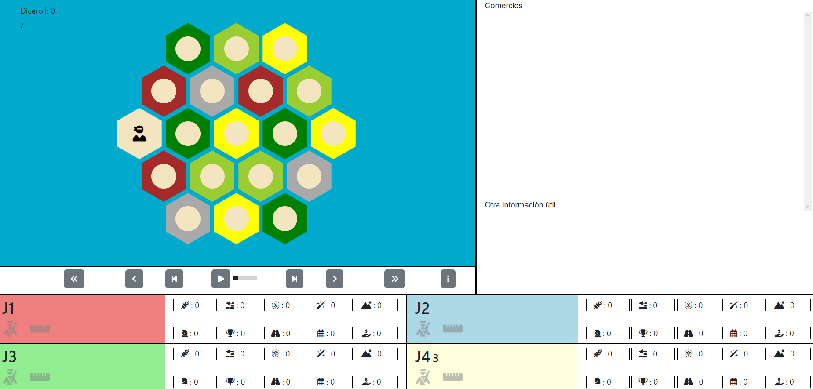

# Catan Simulation in Python

A Settlers of Catan simulator for AI agents written in Python.

## Overview

This repository contains a Python-based simulator for the board game Settlers of Catan. It is designed to test and refine AI agents in a simulated environment. Users can execute predefined agents, as well as introduce their own custom agents into the game.

## Getting Started

### Prerequisites

Ensure you have Python installed on your machine. The simulation is compatible with Python 3.x.

### Adding Your Agents

1. Navigate to the `Agents` folder.
2. Place your custom agent module or Python file in this folder.
3. Ensure your agent class is correctly defined within the module.

### Running the Simulator

To run the simulator, use the `main` module. Specify the agents to be executed and the number of games to be played. Each agent should be referenced by the module or file name, followed by a dot, and then the class name (e.g., `MyModule.MyClass`).

## Reproducing the Practice Results

From the repository root, the final heuristic benchmarks can be reproduced with PowerShell:

```powershell
$env:CATAN_BENCH_AGENTS='[{"class":"PyCatan.Agents.ShiyiHeuristicAgent.ShiyiHeuristicAgent"}]'
$env:CATAN_BENCH_SEEDS='42,2026,31415'
$env:CATAN_BENCH_N_MATCHES='25'
$env:CATAN_BENCH_N_MATCHES_PER_PERM='1'
$env:CATAN_BENCH_MAX_PERMUTATIONS='25'
python -m PyCatan.benchmark_vs_random
python -m PyCatan.benchmark_vs_agentes_estandar
```

LLM runs are controlled through environment variables:

```powershell
$env:CATAN_LLM_PROVIDER='ollama'  # or upv / bedrock
$env:CATAN_LLM_MODEL='qwen2.5:0.5b'
$env:CATAN_LLM_PROMPT_VARIANTS='compact_json,resource_focus,safe_legal'
python -m PyCatan.run_llm_light_matrix
```

For UPV and Bedrock, add the corresponding API endpoint/key or AWS credentials in the environment or `.env` before launching `run_upv_llm_benchmarks.py` or `run_bedrock_llm_benchmarks.py`.

Run the tests from the repository root with:

```powershell
python -m unittest discover -s PyCatan\Tests -p "test_*.py"
```

### Results

After each game, the result is displayed in the console and the game trace is saved in JSON format in the `Traces` folder.

## Visualizing Results

To visualize game results:
1. Open the `index.html` file located in the `Visualizer` folder.
2. Load a JSON trace file by clicking on the three-dot icon located in the controls below the right side of the Catan board.




## Contributing

Contributions to the Catan Simulation in Python are welcome! Please feel free to make changes and submit pull requests.
